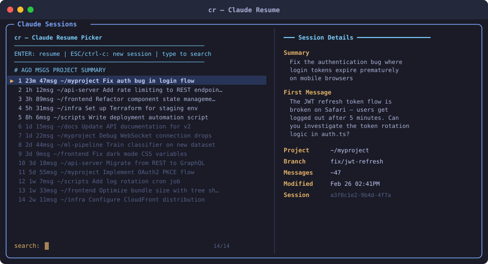

# cr - Claude Resume

A fast, interactive session picker for [Claude Code](https://docs.anthropic.com/en/docs/claude-code). Browse your recent conversations, preview details, and resume any session — all from your terminal.

  

## The Problem

Claude Code stores conversation sessions as `.jsonl` files scattered across `~/.claude/projects/`. When you want to pick up where you left off, you need to remember session IDs or dig through files manually. `claude --resume` exists, but you need to already know the session ID.

## The Solution

`cr` gives you a searchable, previewable list of all your recent Claude Code sessions:

<p align="center">
  
</p>

Select a session and you're back in it. Press `ESC` to start a fresh session instead.

## How It Works

1. **Scans `~/.claude/projects/`** for session index files and raw `.jsonl` conversation logs
2. **Parses session metadata** using an embedded Python script — extracts the first user prompt, message count, project path, git branch, and timestamps
3. **Presents sessions via fzf** with a formatted list showing age, message count, project directory, and a summary/prompt preview
4. **Preview pane** (right side) shows full session details: summary, first message, project path, branch, message count, and session ID
5. **Resumes the selected session** by calling `claude --resume <session-id>`

### Data Sources (Two Phases)

- **Phase 1 — Indexed sessions**: Reads `sessions-index.json` files that Claude Code maintains. These are fast to parse and contain pre-extracted metadata.
- **Phase 2 — Unindexed sessions**: For projects without an index, falls back to scanning raw `.jsonl` files directly. Reads the first ~200 lines to extract the first user prompt and metadata, then estimates total message count from file size.

### Filtering

- Skips sidechain sessions (internal Claude Code branches)
- Strips XML tags, boilerplate prefixes, and interrupted-request markers from prompts
- Filters out empty sessions (no messages and no prompt)

## Installation

### Prerequisites

- **bash** (4.0+)
- **python3** (3.6+)
- **fzf** — install it if you don't have it:
  ```bash
  git clone --depth 1 https://github.com/junegunn/fzf.git ~/.fzf && ~/.fzf/install --bin
  ```
- **Claude Code** — with existing sessions in `~/.claude/projects/`

### Install cr

```bash
# Clone the repo
git clone https://github.com/phelix001/Claude-Resume.git

# Copy to your PATH
cp Claude-Resume/cr ~/.local/bin/cr
chmod +x ~/.local/bin/cr
```

Or as a one-liner:

```bash
curl -o ~/.local/bin/cr https://raw.githubusercontent.com/phelix001/Claude-Resume/main/cr && chmod +x ~/.local/bin/cr
```

## Usage

```bash
# Show the 40 most recent sessions (default)
cr

# Show the 100 most recent sessions
cr 100

# Show only the 10 most recent
cr 10
```

### Controls

| Key | Action |
|-----|--------|
| `Enter` | Resume the selected session |
| `ESC` / `Ctrl-C` | Cancel and start a new Claude session |
| Type | Fuzzy search across all sessions |
| `Ctrl-j` / `Ctrl-k` | Navigate up/down |

## Configuration

`cr` uses `~/.fzf/bin/fzf` by default. If your `fzf` is installed elsewhere, edit the `FZF_BIN` variable at the top of the script.

## License

MIT
